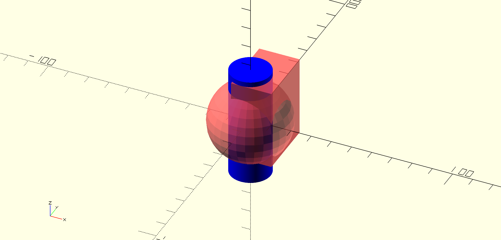
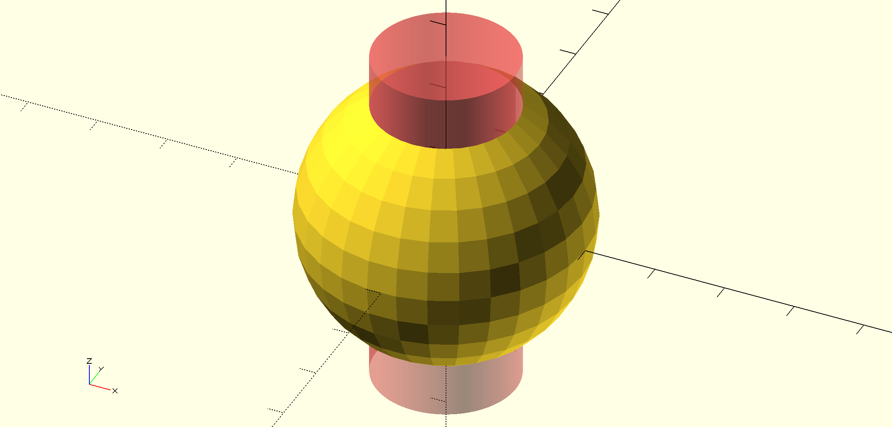
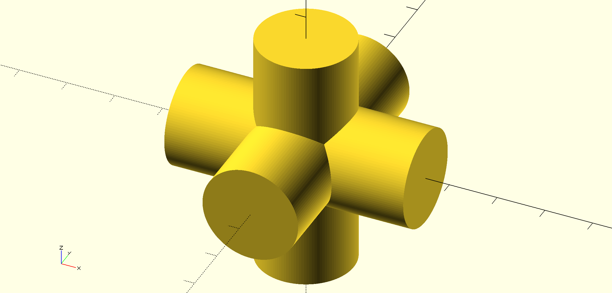
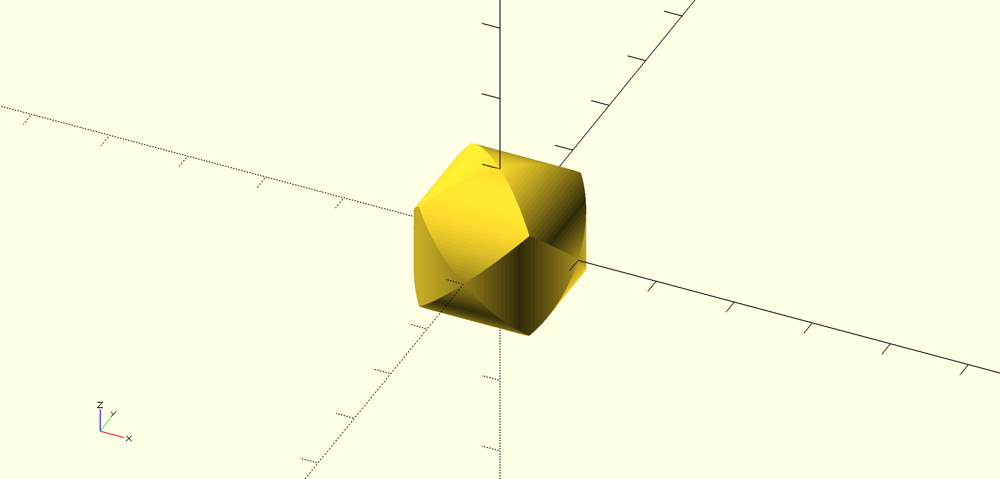
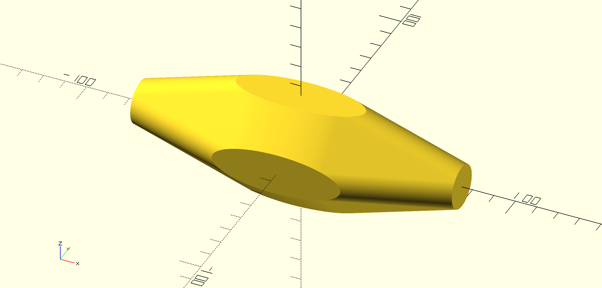
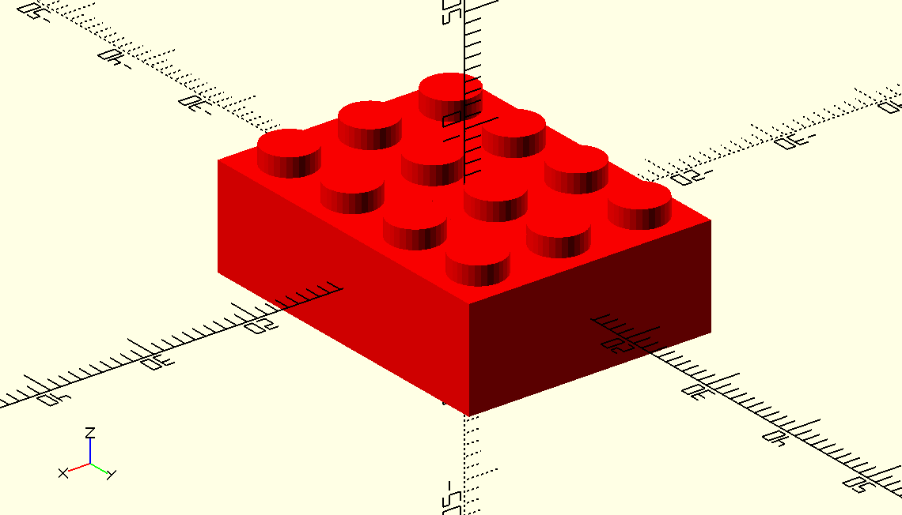
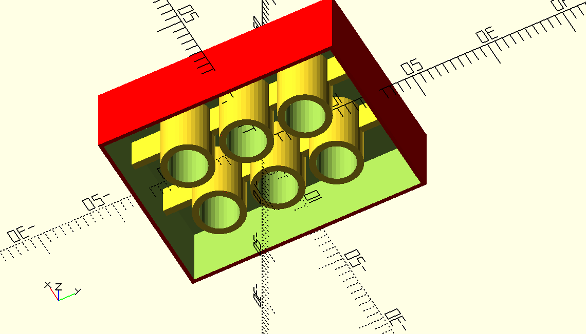

# blox

A Clojure library designed to create parametric 3d models. 

It's inspired by https://github.com/farrellm/scad-clj but the emphasis is on composable functions rather than macros. 

## Usage

The simplest way to try this out is to execute the example functions tx0 .. tx4 towards the end of the scad.clj file. These generate .scad files in the out directory which can be viewed with the Openscad software available from [OpenSCAD.org](http://www.openscad.org/index.html). Or you can just take a look at these pictures:

t0 - an odd shape with some translucent parts:

t1 - a sphere with a cylinder subtracted:

t2 - Jackstone?

t3 - the interior of a Jackstone:

t4 - I have no idea what to call this, it's a hull around a scaled jackstone:

The other file, brick.clj, is an example of using the convenience functions (currently limited to cube, cylinder, difference, translate and union. The brick and plate functions generate something that looks like a lego component. Please note that a 3d printed version of this is almost certainly not going to actually be lego compatible. The interior of the brick is not quite right and the measurements are off. 

(brick 3 4) - an impossible brick:

(brick 3 4) - a view of the interior:

## License

Copyright A. Dwelly © 2017

Distributed under the Eclipse Public License either version 1.0 or (at
your option) any later version.
